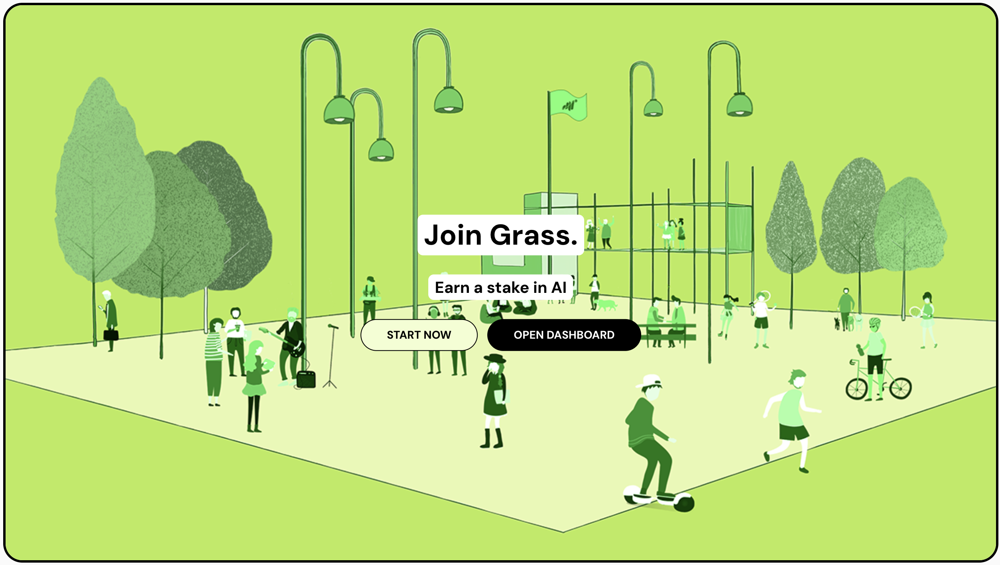

# Grass Mobile Node

**Grass Mobile Node** is a mobile application designed to let users run a Grass node on their mobile devices. Grass Mobile Node brings the power of Grass nodes, previously only available on browser extensions and desktop, into the convenience of mobile.

- [Grass Mobile Node](#grass-mobile-node)
  - [Overview](#overview)
  - [Motivation](#motivation)
  - [Key Features](#key-features)
  - [Getting Started](#getting-started)
  - [Developer Note](#developer-note)
  - [Contributing](#contributing)
  - [Support](#support)

## Overview

Grass nodes provide a decentralized service layer that lets users participate in the Grass network. With **Grass Mobile Node**, users can set up and manage a node directly on their phones, making it easier to stay connected on the go.

## Motivation

Grass nodes were previously limited to desktop applications and browser extensions, which limited mobile accessibility and flexibility. **Grass Mobile Node** was created to fill that gap, enabling Grass network participation on mobile devices.

## Key Features

- **Mobile Node**: Easily run your Grass node directly from your mobile device.
- **Seamless Synchronization**: Stay in sync with the Grass network, with real-time updates and notifications.
- **User-Friendly Interface**: An intuitive, mobile-optimized interface designed for easy node management on the go.
